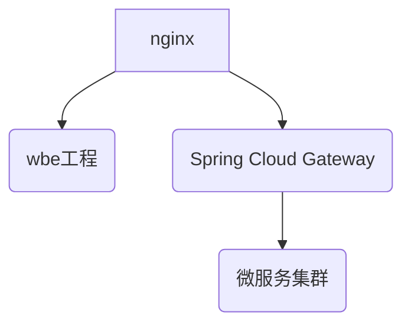

<!-- TOC -->

- [1. 使用特性](#1-使用特性)
  - [1.1. heifer boot](#11-heifer-boot)
    - [1.1.1. ExceptionHandler](#111-exceptionhandler)
    - [1.1.2. ResponseBodyAdvice](#112-responsebodyadvice)
    - [1.1.3. validation](#113-validation)
    - [1.1.4. 异常](#114-异常)
      - [1.1.4.1. 自定义异常枚举](#1141-自定义异常枚举)
      - [1.1.4.2. 异常信息国际化](#1142-异常信息国际化)
  - [1.2. heifer-common-apisix](#12-heifer-common-apisix)
    - [1.2.1. Route 生成规则](#121-route-生成规则)
      - [1.2.1.1. Spring Booth](#1211-spring-booth)
      - [1.2.1.2. Spring Cloud](#1212-spring-cloud)
    - [Zipkin](#zipkin)
  - [1.3. heifer-common-dynamic-datasource](#13-heifer-common-dynamic-datasource)
  - [1.4. heifer-common-feign](#14-heifer-common-feign)
    - [1.4.1. 使用 okhttp](#141-使用-okhttp)
    - [1.4.2. ResponseBodyAdvice自动拆箱](#142-responsebodyadvice自动拆箱)
    - [1.4.3. rpc快速失败](#143-rpc快速失败)
  - [1.5. heifer-common-mybatis-plus](#15-heifer-common-mybatis-plus)
  - [1.6. heifer-common-nacos-discovery](#16-heifer-common-nacos-discovery)
  - [1.7. heifer-common-redis](#17-heifer-common-redis)
    - [1.7.1. Cache Abstraction](#171-cache-abstraction)
    - [1.7.2. lock](#172-lock)
  - [1.8. heifer-common-security](#18-heifer-common-security)
    - [1.8.1. 自定义登陆](#181-自定义登陆)
    - [1.8.2. 自定义拦截器](#182-自定义拦截器)
    - [1.8.3. 忽略路由拦截](#183-忽略路由拦截)
  - [1.9. heifer-gateway](#19-heifer-gateway)
  - [1.10. heifer-metadata](#110-heifer-metadata)
  - [1.11. heifer-plugin-aliyun-oss](#111-heifer-plugin-aliyun-oss)
    - [1.11.1. 服务端签名后直传](#1111-服务端签名后直传)
    - [1.11.2. Resource支持](#1112-resource支持)
  - [1.12. heifer-plugin-iam](#112-heifer-plugin-iam)
  - [1.13. heifer-plugin-iam-security](#113-heifer-plugin-iam-security)
    - [1.13.1. 权限拦截](#1131-权限拦截)
    - [1.13.2. user解析](#1132-user解析)
    - [1.13.3. 数据权限](#1133-数据权限)

<!-- /TOC -->


# 1. 使用特性

## 1.1. heifer boot

集成了 Spring MVC和validation


### 1.1.1. ExceptionHandler
提供全局拦截器, 对异常进行全局拦截器

异常返回格式
```json
{
  "code": "",
  "message": "",
  "data": {},
  "@comment": {
    "code": "/** 业务错误码 */",
    "message": "/** 信息描述 */",
    "data": "/** 返回参数 */"
  }
}

```


### 1.1.2. ResponseBodyAdvice

全局统一返回

Controller的类或者方法中使用了 ``@ResultResponseBody``就会进行装箱

```json
{
  "code": "",
  "message": "",
  "data": {},
  "@comment": {
    "code": "/** 业务错误码 */",
    "message": "/** 信息描述 */",
    "data": "/** 返回参数 */"
  }
}
```   

### 1.1.3. validation


添加快速失败


### 1.1.4. 异常

plus.wcj.heifer.metadata.exception.ResultException是定制的异常类, 支持国际化, 枚举类, 占位符


#### 1.1.4.1. 自定义异常枚举


自定义异常枚举需要实现plus.wcj.heifer.metadata.exception.ResultStatus

例子
```java
public enum plus.wcj.heifer.boot.common.exception.ResultStatusEnum implements ResultStatus {
    /** 请求成功 */
    SUCCESS(HttpStatus.OK, "200", "OK"),
  
    /** 返回的HTTP状态码,  符合http请求 */
    private final HttpStatus httpStatus;
    /** 业务异常码 */
    private final String code;
    /** 业务异常信息描述 */
    private final String message;

    ResultStatusEnum(HttpStatus httpStatus, String code, String message) {
        this.httpStatus = httpStatus;
        this.code = code;
        this.message = message;
    }

    get  ...
}
```

#### 1.1.4.2. 异常信息国际化

默认添加异常信息国际化

messages.properties格式定义
```properties
 
 # {class全路径}.{枚举}={异常信息}

 # 无占位符
plus.wcj.heifer.boot.common.exception.ResultStatusEnum.SUCCESS=OK

 # 占位符返回
plus.wcj.heifer.boot.common.exception.ResultStatusEnum.SUCCESS=OK{}
```


## 1.2. heifer-common-apisix

大部分公司的网关设计都为``流量网关（nginx）``+``业务网关（gateway）``两层网关的设计，流量网关主要用web服务器和上游负载均衡，业务网关主要用于Spring Cloud环境下的负载均衡， heifer在设计之初也是采用了两层网关设计，两层网关设计增加了通讯成本和运维成本。




每个 service 在第启动的时候会去Apache APISIX检查是否采摘当前service的配置信息, 如果配置信息不存在就会创建一个Route.
id使用md5生成


目前和Apache APISIX集成的相关插件

| 插件名称                | 默认开启                      | 相关依赖                              |
| ----------------------- | ----------------------------- | ------------------------------------- |
| RoutesCustomizer        | 开启                          | web环境                               |
| ProxyRewritePlugin      | 开启                          | web环境                               |
| NacosUpstreamCustomizer | 引入nacos后自动开启           | Spring Cloud Alibaba nacos  discovery |
| ZipkinPlugin            | 引入sleuth和zipkin2后自动开启 | spring-cloud-sleuth-zipkin            |


### 1.2.1. Route 生成规则
Spring Boot和Spring Cloud生成时候在，Spring Cloud多了一个注册中心的原因，Route注册upstream会有所变化，其他的基本上都是一致的
#### 1.2.1.1. Spring Booth
```json
{
  "uri": "/heifer-boot-examples/*",
  "name": "heifer-boot-examples",
  "desc": "Heifer create",
  "plugins": {
    "proxy-rewrite": {
      "regex_uri": [
        "^/heifer-boot-examples/(.*)",
        "/$1"
      ]
    }
  },
  "upstream": {
    "nodes": [
      {
        "host": "192.168.31.64",
        "port": 58329,
        "weight": 1
      }
    ],
    "type": "roundrobin",
    "hash_on": "vars",
    "scheme": "http",
    "pass_host": "pass"
  },
  "labels": {
    "service": "heifer-boot-examples",
    "source": "SPRING_BOOT"
  },
  "status": 1
}
```
#### 1.2.1.2. Spring Cloud
``` json
{
  "uri": "/heifer-boot-examples/*",
  "name": "heifer-boot-examples",
  "desc": "Heifer create",
  "plugins": {
    "proxy-rewrite": {
      "regex_uri": ["^/heifer-boot-examples/(.*)", "/$1"]
    }
  },
  "upstream": {
    "type": "roundrobin",
    "hash_on": "vars",
    "scheme": "http",
    "discovery_type": "nacos",
    "discovery_args": {
      "group_name": "DEFAULT_GROUP",
      "namespace_id": "public"
    },
    "pass_host": "pass",
    "service_name": "heifer-boot-examples"
  },
  "labels": {
    "group": "DEFAULT_GROUP",
    "namespace": "public",
    "service": "heifer-boot-examples",
    "source": "SPRING_CLOUD_ALIBABA"
  },
  "status": 1
}
```
### Zipkin
引入Zipk后json数据增加一下数据
```json
{
  "plugins": {
    "zipkin": {
      "endpoint": "http://192.168.31.112:9411/api/v2/spans",
      "sample_ratio": 1,
      "service_name": "heifer-common-apisix-example-APISIX",
      "span_version": 2
    }
  }
}

```


## 1.3. heifer-common-dynamic-datasource
感觉没有多少用处, 还不如直接买阿里云的高性能服务器


## 1.4. heifer-common-feign

feign集成 okhttp, ResponseBodyAdvice自动拆箱, rpc快速失败

### 1.4.1. 使用 okhttp

开启okhttp需要配置文件开启,
```properties
feign:
  okhttp:
    enabled: true
  httpclient:
    enabled: false
```


### 1.4.2. ResponseBodyAdvice自动拆箱

ResponseBodyAdvice在Spring Boot当中是没有侵入性的,但是在Spring Cloud OpenFeign中具有了侵入性, 目前仅判断 feign interface的方法和类中使用了 ``@ResultResponseBody``就会进行拆箱


### 1.4.3. rpc快速失败
使用Spring Boot的全局异常拦截, 拦截``FeignException``, 然后一直将信息返回给调用方.

web浏览器->A服务->B服务->C服务

如果C服务发生了异常会被Spring Boot全局异常拦截,返回异常信息给B服务, B服务拦截``FeignException``将C服务的异常信息原封不动的返回给A服务, A服务拦截``FeignException``将信息原封不动的返回给web浏览器,


## 1.5. heifer-common-mybatis-plus

也是一个没有多少作用的功能模块

MyBatis Plus在Spring Boot环境中开发是一件很舒服的事情,但是他对项目的健康度不是很友好, 建议使用heifer提供的IService可以稍微增加一下鲁棒性

1. Wrapper灵活度太高, 无法让模块形成高内聚
2. soa开发时直接暴露service层时 Wrapper序列化和反序列化时有很大问题


## 1.6. heifer-common-nacos-discovery

目前没有多少作用,就是注册的时候Instance会注入一些元数据, 就jvm信息呀,os信息呀. 方便以后做做些基于元数据的骚操作啦


## 1.7. heifer-common-redis
这个模块也就那样子吧, 缓存和锁

### 1.7.1. Cache Abstraction
jsr107的那些注解和spring cache的那些注解啦,
基于Redis cache增加了一个时间偏移量, 防止面试的天天问我Redis雪崩和击穿这些问题的出现啦

``spring.cache.redis.time-offset-to-live``偏移量配置路径也就那样子 会在timeToLive+timeToLiveOffset之间产生一个随机数,

### 1.7.2. lock
Redis 锁, 也就那样子啦 , 悲观锁呀,tryLock呀,没有多大用处的,

要不要增加注解模式的锁呐,反正百度一大堆, 懒得弄了


## 1.8. heifer-common-security

啧啧,有趣的模块了, 因为Spring Security的模块设计太繁琐了,


### 1.8.1. 自定义登陆
删除了默认的UserDetailsService,所以你无法登陆, 需要自定义登陆
自己造一个Controller进行多因子登陆多方便呀,比写什么过滤器呀,拦截器呀,userDetailsService什么的方便多了,随便玩了.

### 1.8.2. 自定义拦截器

自己去实现 IamOncePerRequestFilter 就可以了实现 token解析这些了, 然后把解析数据放进Spring Security context里面


### 1.8.3. 忽略路由拦截

嗯, 设计了2个部分
1. 配置忽略: 适合静态资源和Controller
2. 注解忽略: 适合Controller
3. 实现IgnoredRequestConfigurer接口   ``我没有做进去,哈哈哈哈``

> 配置忽略
```properties
heifer.security.ignore.matchers:
    pattern:
    get:    
    post:    
    delete:    
    put:    
    head:    
    patch:    
    options:    
    trace:    
```

> 注解忽略

```java
    // 类和方法都支持
    @RequestMapping(value = {"ignoreWebSecurity")
    @IgnoreWebSecurity
    public String ignoreWebSecurity() {
        return "IgnoreWebSecurity";
    }

```

## 1.9. heifer-gateway
没啥好说的, 加了nacos, loadbalancer,actuator

引用一下,加一下配置就可以了
```yml
spring:
  application:
    name: heifer-gateway
  cloud:
    nacos:
      discovery:
        server-addr: heifer.wcj.plus:8848
    gateway:
      discovery:
        locator:
          enabled: true
server:
  port: 8080
management:
  endpoints:
    web:
      exposure:
        include: gateway
  endpoint:
    health:
      show-details: always
```


## 1.10. heifer-metadata


就是各个模块中共用的 bean啦,

## 1.11. heifer-plugin-aliyun-oss
就很正经的oss, 能支持多个oss操作啦, 默认实现了OssController和AliyunOssServer, 觉得不好用就自己造一个吧,

配置如下
```yml
heifer:
    aliyun: 
        bucket1:
            accessId: 
            accessKey: 
            bucket: 
            endpoint: 
            host: 
            expire: 
        bucket2:
            accessId: 
            accessKey: 
            bucket: 
            endpoint: 
            host: 
            expire: 
```

### 1.11.1. 服务端签名后直传
设计之初就按照[服务端签名后直传](https://help.aliyun.com/document_detail/31926.html), AliyunOssServer那几个上传是给本地文件上传用的,

看``AliyunOssServer#policy`` 的实现的,


### 1.11.2. Resource支持

Resource本身是spring提供读取文件的, 和spring的原生用法一直, 很方便.
xxx就是``heifer.aliyun``配置的key,

```java
    @Value("oss://xxx/sister1.jpg")
    private Resource defaultFile;
```
## 1.12. heifer-plugin-iam
iam服务支持saas, 提供多租户,数据权限,功能权限,rbac,acl, 用户跨租户, 登陆等等等

因为不会大前端 所以一直没有对接前端页面, 也就 table设计有参考价值

后面说吧

## 1.13. heifer-plugin-iam-security


由于plugin模块设计的是偏向于业务的, 所以这一块太TMD复杂了,
涉及到到plugin和common多个模块之间的联动

1. ``heifer-plugin-iam``提供 授权
2. ``heifer-common-security``提供 鉴权模型, 需要完善多个接口才能使用

``heifer-plugin-iam-security``本身设计存在``有状态``和``无状态``两个方案, 所以本身就是很难抉择的一个东西, 最后选择了 ``有状态``设计. 所以存在多个模块的耦合.

``heifer-plugin-iam``+``heifer-plugin-iam-security``即可实现权限的自举,


1. 实现了``IamOncePerRequestFilter``来完成token的解析
2. 实现了``UserPrincipalService``来完成 获取``heifer-plugin-iam``的权限信息
3. ``UserPrincipalService``的类都修饰了 ``@Cacheable`` 具有缓存性质, 在分布式缓存的情况中能保证性能, 但是在本地缓存中的存在过期问题

### 1.13.1. 权限拦截

``JwtTokenAuthenticationFilter``实现``IamOncePerRequestFilter``完成对jwt的解析
jwt无效就会立马返回401
jwt有效就调用``UserPrincipalService``获取功能权限并生成一个用户注入SecurityContext中

### 1.13.2. user解析
支持 UserDetails和Tenant在Controller层的注入,  解决了Spring Security context这种线程隐式传递带来的问题,

没有用aop或者代理来实现注入, 不会有性能上面的问题的啦

```java
    @RequestMapping
    public void hello (Tenant tenant, UserDetails userDetails, @RequestBody Object body){
        return null
    }
```
### 1.13.3. 数据权限

数据权限都存在tenant中了, 详细查看tenant类就可以了


